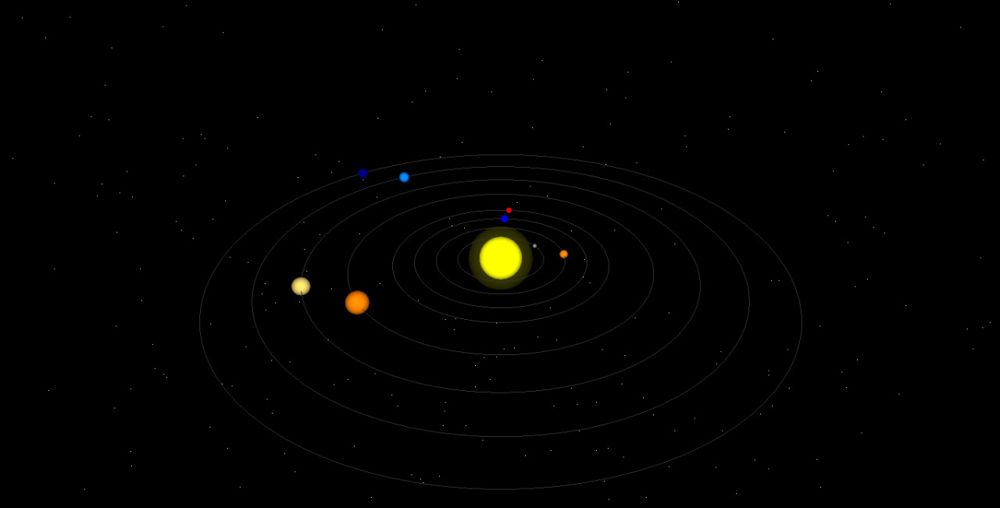

# Solar System Simulation with OpenGL



This project simulates the solar system using OpenGL and glut library in C++. It displays planets orbiting around the sun with realistic rotations based on actual planetary data.

## Features

- **Realistic Planetary Orbits**: Planets orbit around the sun with accurate distances and speeds derived from real data.
- **Interactive Controls**: Zoom in and out using keyboard controls to observe the solar system up close or from afar.
- **Dynamic Lighting**: Sun glow effect and dynamically adjusted lighting to enhance visual appeal.
- **Starry Background**: A starry background adds to the immersive experience of space.

## Installation

### Prerequisites

- OpenGL and glut libraries installed on your system.

### Clone

1. Clone the repository:
   ```bash
   git clone https://github.com/SamaRostami/Solar-System-OpenGL.git
   ```
 

2. Navigate to the project directory:
    ```bash
    cd solar-system-opengl
    ```

### Build

3. Compile the program (ensure OpenGL and glut libraries are installed):
    ```bash
    gcc main.c -o solar_system -lGL -lglut -lm
    ```

### Run

4. Run the program:
   ```bash
    ./solar_system
    ```

## Controls
1. **Zoom In**: Press `+` key to zoom in.
2. **Zoom Out**: Press `-` key to zoom out.
3. **Exit**: Press `Esc` or `q` to exit the simulation.

## License
This project is licensed under the MIT License.

## Contact
For any questions or feedback, feel free to contact me at `samasky.rostami@gmail.com`.